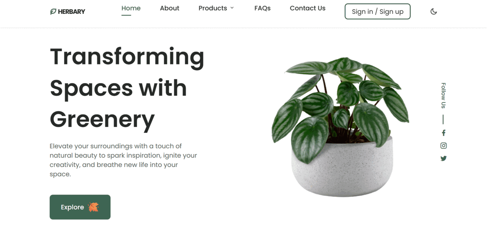

# Herbary - Plant Store

Welcome to Herbary, an online plant store where you can browse and purchase a wide variety of plants. This website is built using HTML, CSS, and JavaScript.

## Table of Contents

- [Features](#features)
- [Demo](#demo)
- [Built with](#built-with)
- [Installation](#installation)
- [Usage](#usage)
- [Contributing](#contributing)
- [License](#license)

## Features

- Browse through a diverse collection of plants.
- View detailed information about each plant, including price and images.
- Responsive design for a seamless experience on desktop and mobile devices.

## Demo

Check out the live demo of the website [here](https://herbary.netlify.app/).



## Built with

The [Herbary](https://herbary.netlify.app/) plant store was developed using the following libraries and resources:

- [HTML](https://www.w3schools.com/html/)<br>
- [CSS](https://www.w3schools.com/css/default.asp)<br>
- [JavaScript](https://www.w3schools.com/js/default.asp)

## Installation

To set up a local development environment, follow these steps:

1. Clone the repository:

   ```bash
   git clone https://github.com/agrSaket/herbary.git

2. Navigate to the project folder:
   ```bash
   cd herbary
4. Open the 'index.html' file in your preferred web browser.

## Usage
1. Explore the plant catalog by browsing through different categories.
2. Click on a plant to view more details about it.

## Contributing
Contributions are always appreciated! If you have any suggestions or would like to contribute to the project, please follow these steps:

1. Fork the repository.
2. Create a new branch: `git checkout -b feature/newfeature`.
3. Commit your changes: `git commit -m 'Add some feature'`.
4. Push to the branch: `git push origin feature/newfeature`.
5. Open a pull request.

## License
This project is licensed under the `MIT License`.
